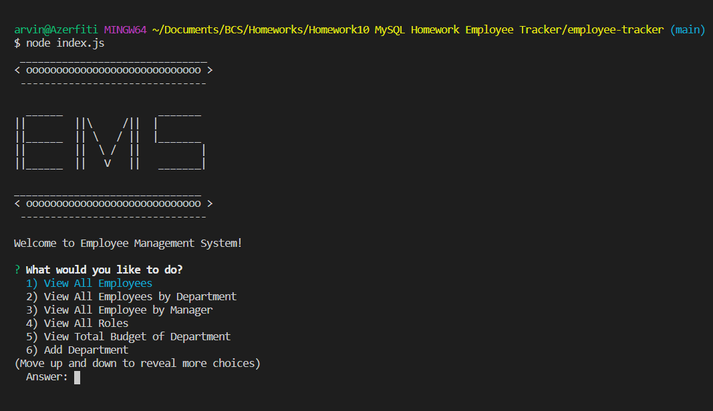
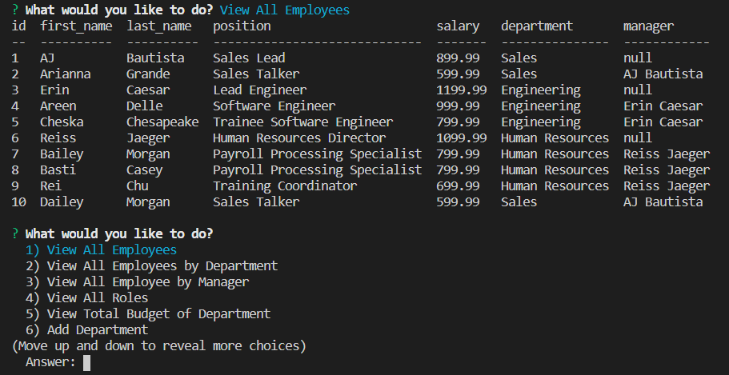
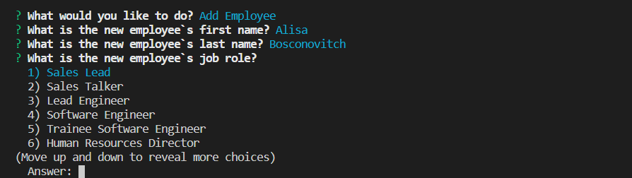
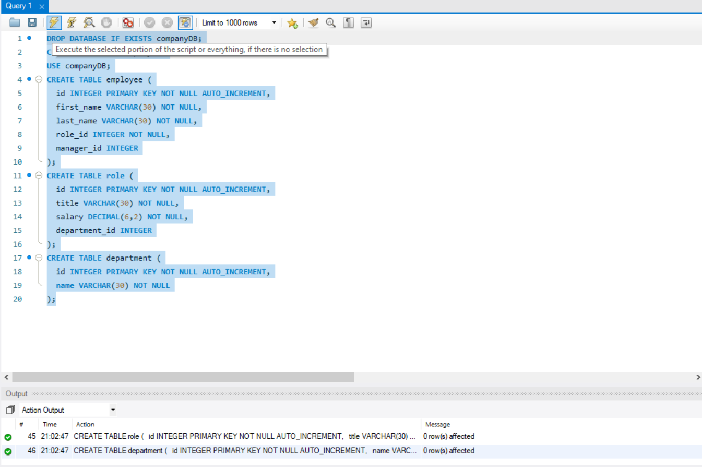
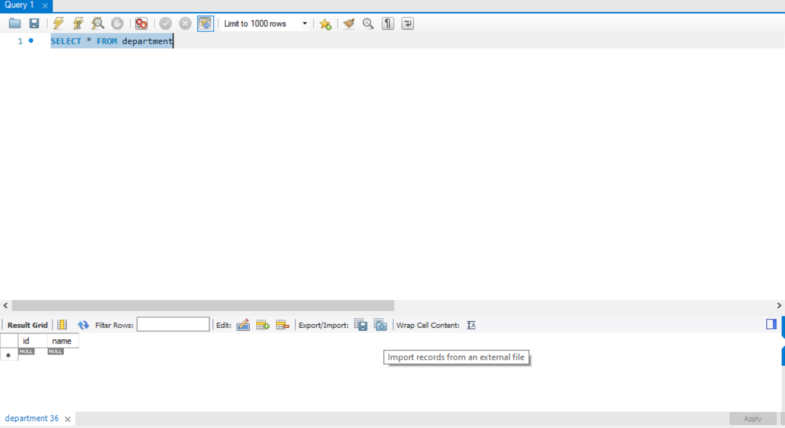
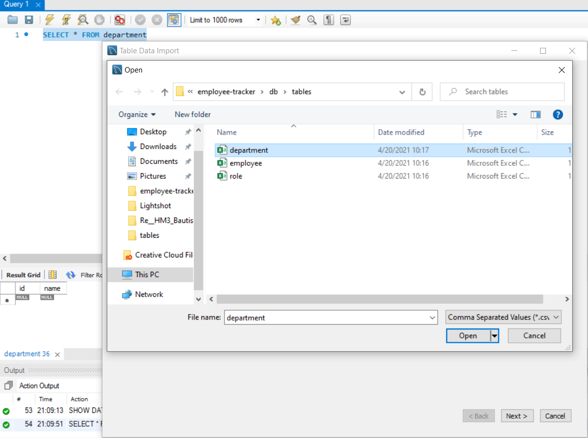
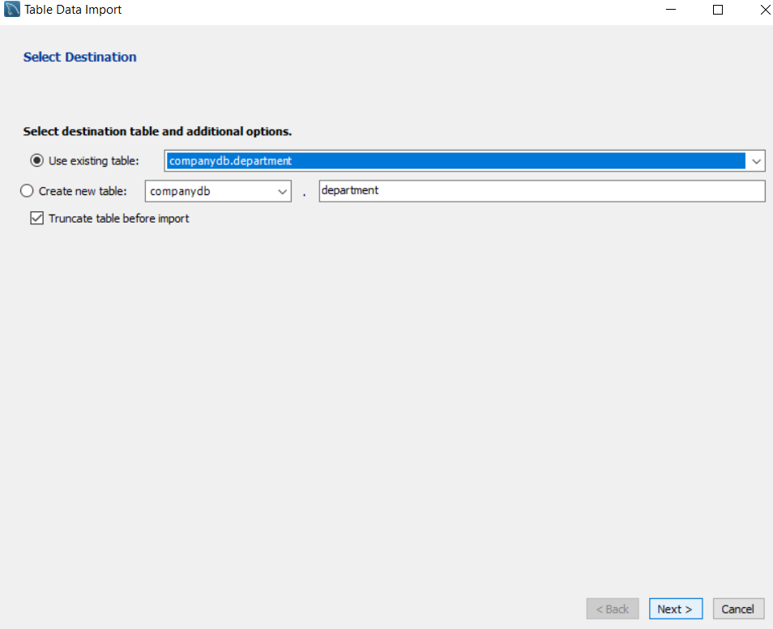
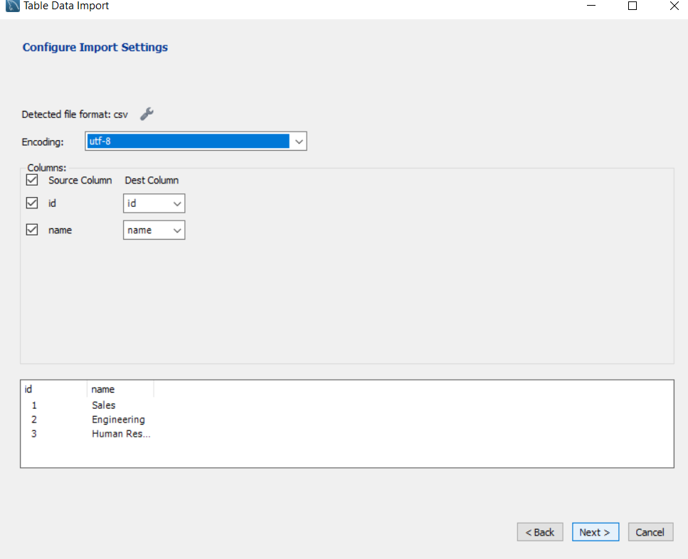
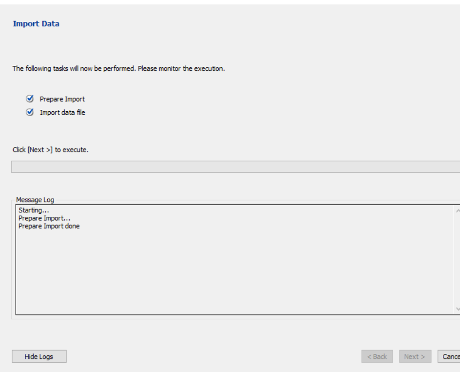

# Unit 12 MySQL Homework: Employee Tracker
## Description
Developers are often tasked with creating interfaces that make it easy for non-developers to view and interact with information stored in databases. Often these interfaces are known as **Content Management Systems**.  

This command-line application allows the user to manage his/her employees by the following actions:
 - Add departments, roles, employees
 - View departments, roles, employees
 - Update employee roles

This application is using the following dependencies:
 - console.table
 - inquirer
 - mysql

 ## Table of Contents

* [Installation](#installation)

* [Screenshots](#screenshots)

* [ImportingCSV](#importingCSV)

* [Demo](#demo)

* [Acknowledgements](#acknowledgements)

## Installation

Run dependencies:

```bash
npm i
```

For creating and using the same database structure:

```bash
mysql -u root -p < db/schema.sql
```

For pre-populating the database:

```bash
mysql -u root -p < db/schema.sql
```

For starting the command-line application:

```bash
node index.js
```

## Screenshots

- **Upon launching the command-line application.** 



- **Viewing employees.** 



- **Adding new employee.**  



## ImportingCSV

Importing .csv files to mySQL workbench guide  
.csv files can be accessed in `./db/tables` directory

- **Copy and paste entire code of schema.sql to your workbench** 



- **Execute(Thunderbolt without the 'I' in upper left menu) the `SELECT * FROM department` and click on the 'Import records from an external file'** 



- **Pathfile the corresponding .csv file to the table being SELECTED, in this case, its the 'department.csv' because we used `SELECT * FROM department`** 



- **Make sure to use existing table if you already have the structure in your database, check Truncate** 



- **Make sure to double check the column names** 



- **Click Next to execute the importing, you can click Show Logs to see the progress, do the rest for the other tables** 



## Demo

- https://drive.google.com/file/d/12JapIB4yRV756iFYpUKJrwmAzyhEA_zS/view


## Acknowledgements
- Mr. John
- Mr. Luis
- Would like to commend the following persons for helping directly(guiding me what to do next)/indirectly(asking questions that I'm not aware of):
  - Oliver Shi
  - Brian Hernandez

- https://gist.github.com/lhorie/1204893c2f0e3ba3c14ac204b2df4b24